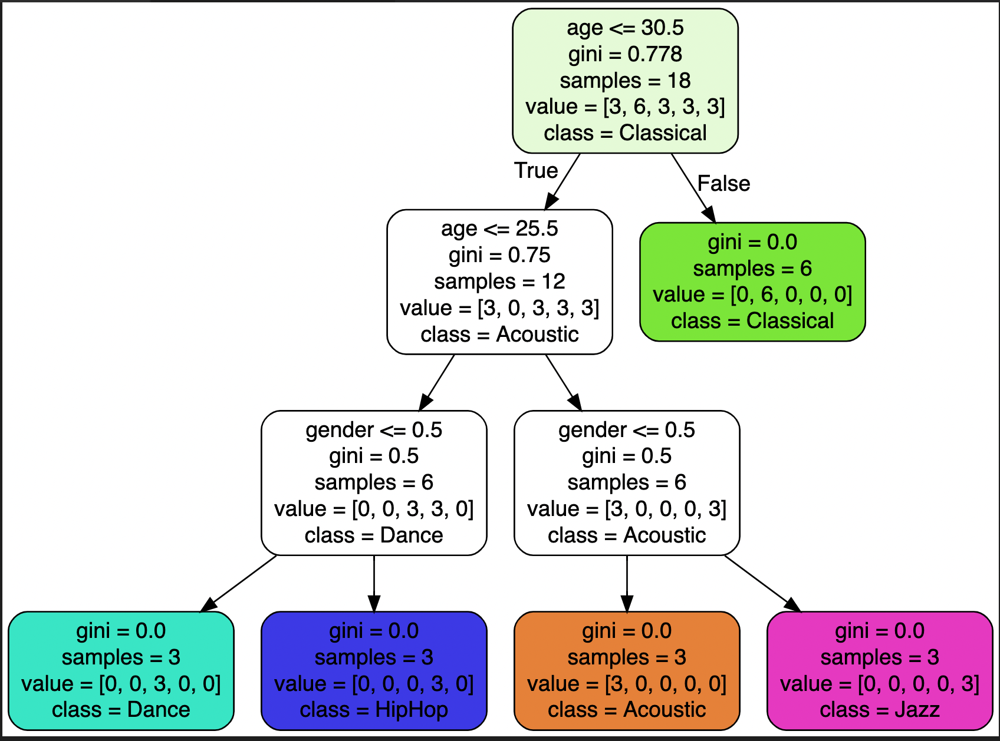

# ML-Refreshing

## To Visualize the dot file

Install the below extension in the Visual Studio Code and Run the below command

Graphviz (dot) language support for Visual Studio Code

In Mac use `command+shift+v` - to visualize the dot file

